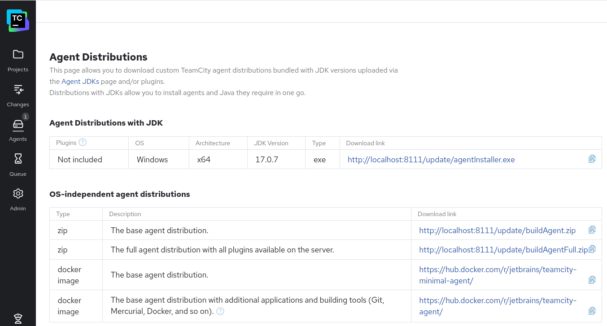

author:         saba    
version:        v1.0
date:           Januar 30th, 2026

# Teamcity Agents

## Install Agents

Introduction - Overview

Agents are workers, which are responsible to create the images. They must be "installed", then authorized/registered on the TeamCity Server. In enterprise, the server and the agents should be separeated on different machines, in order to modularity. Anyway, in this lab the agents are installed on the same machine as the server. Installing agents means, downloading the desired distributions, install or unpack it to the correct path and start it. 

Its important to mention, that additional tools (git, maven, nodejs npm, podman) must be installed to can use the teamcity and agents for these tasks. 

To install agents, we need have login to TeamCity Server and going to the Agents menu.
Usually it can be reached under:
[TeamCity Agents](http://<teamcity-server>:8111/agents.html)

At the right upper side of the screen, we choose the "Install build Agents" button. Its going to a separate page, which contain the link to all kind of Agents, that are available to install.

[Install Agents](http://localhost:8111/installFullAgent.html)

- choose the desired one,
- download,
- unpack it to the `/opt`



```bash
# very first, if its not ready, create a dedicated user to teamcity

sudo useradd \
  --system \
  --home /opt/teamcity \
  --shell /bin/bash \
  teamcity

# set password for teamcity user

sudo passwd teamcity

# add user to docker group

sudo usermod -aG docker teamcity

# set permissions

sudo chown -R teamcity:teamcity /opt/teamcity/buildAgent


# download agent

cd /opt
wget http://localhost:8111/update/buildAgent.zip

# extract it

unzip buildAgent.zip
mv buildAgent teamcity-agent

# standard path for agents: /opt/teamcity-agent
# extract it 

unzip buildAgent.zip
mv buildAgent teamcity-agent

# should looking like

/opt/teamcity-agent/
├── bin/
├── conf/
├── lib/
└── logs/
# configuring agents

/opt/teamcity-agent/conf/buildAgent.properties

# place these lines into the file

serverUrl=http://localhost:8111
name=agent-local-01

# config file creating, default is not exist
# first go to agent config directory

cd /opt/teamcity-agents/buildAgentFull/conf

# create a real config from the template

cp buildAgent.dist.properties buildAgent.properties

# edit the config

nano buildAgent.properties

serverUrl=http://localhost:8111
name=agent-local-01

# save and exit, after that

cd /opt/teamcity-agents/buildAgentFull/bin
./agent.sh start


# start the agents

./agent.sh status

# in teamcity, authorize agents

Administration → Agents

# if everything fine

Agent is running

# if it fails

tail -f /opt/teamcity-agent/logs/teamcity-agent.log

# recommended - systemd 

sudo ln -s /opt/teamcity-agent/bin/agent.sh /etc/init.d/teamcity-agent
sudo systemctl daemon-reexec
sudo systemctl enable teamcity-agent
sudo systemctl start teamcity-agent

# important 
# agents runs as a user, not root

sudo chown -R teamcity:teamcity /opt/teamcity-agent

# or for lab setup

sudo chown -R $USER:$USER /opt/teamcity-agent

```
## Troubleshooting at start

```bash
# we get a error message

Java executable is found: '/usr/lib/jvm/jdk-17.0.9+9/bin/java' Checking TeamCity build agent status... 18:50:20.987 [main] ERROR jetbrains.buildServer.agent.run.XmlRpc - Unable to locate agent port file: /opt/teamcity-agents/buildAgentFull/logs/buildAgent.xmlRpcPort [18:50:20,987] ERROR - ver.agent.run.XmlRpc [main] Unable to locate agent port file: /opt/teamcity-agents/buildAgentFull/logs/buildAgent.xmlRpcPort 18:50:20.996 [main] ERROR jetbrains.buildServer.agent.run.XmlRpc - Agent is not running? [18:50:20,996] ERROR - ver.agent.run.XmlRpc [main] Agent is not running? RUNNING: Service is running

# whats really means

Unable to locate agent port file:
.../logs/buildAgent.xmlRpcPort
Agent is not running?
RUNNING: Service is running
```

Explanation (important)
agent.sh status checks a runtime file (buildAgent.xmlRpcPort)
That file is created only after the agent fully starts and connects
At the moment of the check:
- the process exists
- but the agent has not fully initialized yet

So:

- process → running
- RPC port file → not created yet
- status script → confused

This is a startup timing / initialization issue, very common on first start.

```bash
# to get the real picture, open agent log

tail -f /opt/teamcity-agents/buildAgentFull/logs/teamcity-agent.log

# it will be show something like that 

Connecting to server http://localhost:8111
Successfully connected to TeamCity server
Agent authorized: false

# or

Agent is unauthorized
```

Check the same on TeamCity GUI `Administration > Agents`
Usually, before we can use it, we must be authenticate >> authorize the Agents.

- if the agent not visible on the ui, please check the correct setting in the 
`cat /opt/teamcity-agents/buildAgentFull/conf/buildAgent.properties`
- look for the correct settings about the Teamcity server 
`serverUrl=http://localhost:8111`

- verify permissions, agent must be written here
`ls -ld /opt/teamcity-agents/buildAgentFull/logs`

- fix it, if needed
`sudo chown -R $USER:$USER /opt/teamcity-agents/buildAgentFull`

- then restart
```bash
./agent.sh stop
./agent.sh start
```
- Verify no leftover PID / stale state

On failed first runs, stale files can confuse status checks.

Clean restart:
```bash
./agent.sh stop
rm -f /opt/teamcity-agents/buildAgentFull/logs/buildAgent.*
./agent.sh start
```

## Running Agents

```bash
cd /opt/teamcity-agents/buildAgentFull/bin
sudo ./agent.sh stop


```
